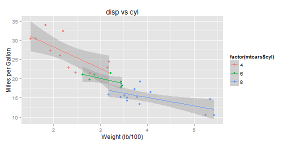

## The data Set 

The data was extracted from the 1974 Motor Trend US magazine, and comprises fuel consumption and 10 aspects of automobile design and performance for 32 automobiles (1973-74 models).


Here is a data sample: 


```
##                    mpg cyl disp  hp drat    wt  qsec vs am gear carb
## Mazda RX4         21.0   6  160 110 3.90 2.620 16.46  0  1    4    4
## Mazda RX4 Wag     21.0   6  160 110 3.90 2.875 17.02  0  1    4    4
## Datsun 710        22.8   4  108  93 3.85 2.320 18.61  1  1    4    1
## Hornet 4 Drive    21.4   6  258 110 3.08 3.215 19.44  1  0    3    1
## Hornet Sportabout 18.7   8  360 175 3.15 3.440 17.02  0  0    3    2
## Valiant           18.1   6  225 105 2.76 3.460 20.22  1  0    3    1
```

--- 

## Functionality
The application uses the ggplot2 library.

* Choose Y-axis and X-axis variables

* Choose a group attribute (group by color)

* Add a regression line

* Automatic update plot title 

---

## ggplot2 example


```r
require(ggplot2)
ggplot(mtcars, aes(x=mtcars$wt, y=mtcars$mpg, colour=factor(mtcars$cyl)))+geom_point() +  geom_smooth(method=lm) +  ggtitle("disp vs cyl") +  xlab("Weight (lb/100)")+  ylab("Miles per Gallon")
```

 

---

## Shiny Application

the shiny application can be found here 

https://petchon.shinyapps.io/DEVDP/

thank you!

